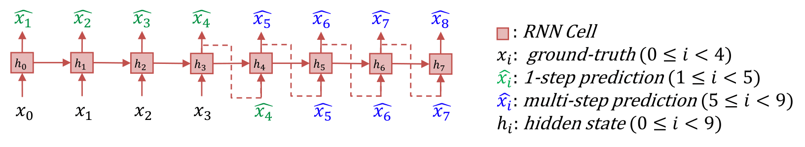
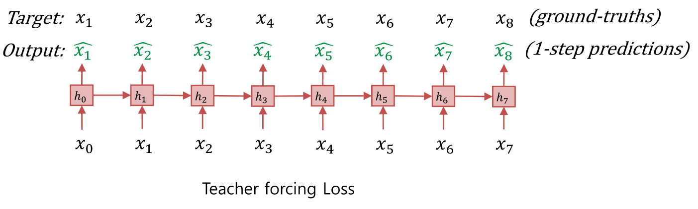
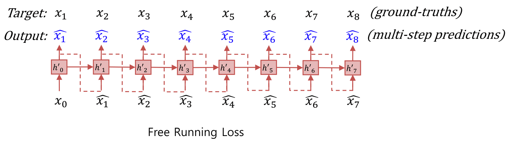
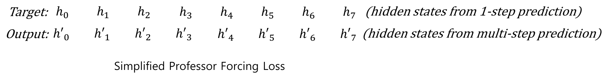
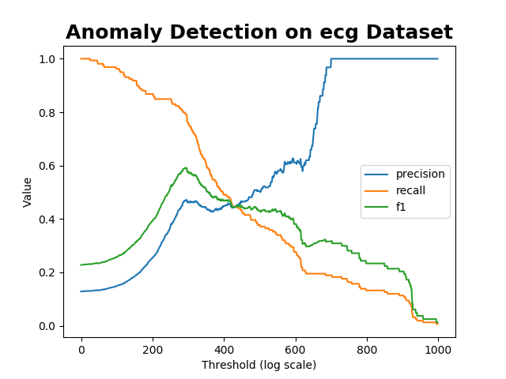
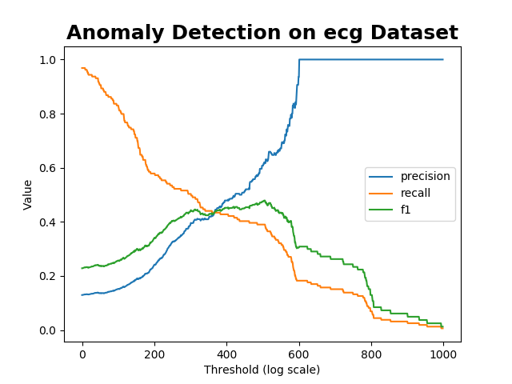

# RNN-Time-series-Anomaly-Detection
RNN based Time-series Anomaly detector model implemented in Pytorch.

This is an implementation of RNN based time-series anomaly detector, which consists of two-stage strategy of time-series prediction and anomaly score calculation.


## Requirements
* Ubuntu 16.04+ (Errors reported on Windows 10. see [issue](https://github.com/chickenbestlover/RNN-Time-series-Anomaly-Detection/issues/6#issue-358550020). Suggesstions are welcomed.)
* Python 3.5+
* Pytorch 0.4.0+
* Numpy
* Matplotlib
* Scikit-learn

## Dataset
__1. NYC taxi passenger count__
 * The New York City taxi passenger data stream, provided by the [New
York City Transportation Authority](http://www.nyc.gov/html/tlc/html/about/trip_record_data.shtml )
 * preprocessed (aggregated at 30 min intervals) by Cui, Yuwei, et al. in ["A comparative study of HTM and other neural network models for online sequence learning with streaming data." Neural Networks (IJCNN), 2016 International Joint Conference on. IEEE, 2016.](http://ieeexplore.ieee.org/abstract/document/7727380/)
  , [code](https://github.com/numenta/htmresearch/tree/master/projects/sequence_prediction)

__2. Electrocardiograms (ECGs)__
 * The ECG dataset containing a single anomaly corresponding to a pre-ventricular contraction

__3. 2D gesture (video surveilance)__
 * X Y coordinate of hand gesture in a video

__4. Respiration__
 * A patients respiration (measured by thorax extension, sampling rate 10Hz)

__5. Space shuttle__
 * Space Shuttle Marotta Valve time-series

__6. Power demand__
 * One years power demand at a Dutch research facility

The Time-series 2~6 are provided by E. Keogh et al. in
["HOT SAX: Efficiently Finding the Most Unusual Time Series Subsequence." In The Fifth IEEE International Conference on Data Mining. (2005)
](http://ieeexplore.ieee.org/abstract/document/1565683/)
  , [dataset](http://www.cs.ucr.edu/~eamonn/discords/)

### **_DISCLAIMER_**: 
_<U>The labels provided on this repository are unofficial and have not been verified. Labels were unofficially created by non-experts (annotated without any domain knowledge of the dataset) and contains mislabeled points. 
We referred to other time-series anomaly detection papers using the datasets   ([Malhotra et al., 2015.](https://www.elen.ucl.ac.be/Proceedings/esann/esannpdf/es2015-56.pdf),
[Malhotra et al., 2016.](https://arxiv.org/pdf/1607.00148.pdf)) 
and the author's dataset presentation slides to label anomaly points in this time series as accurately as possible. Nevertheless, since we are neither the authors of the dataset nor the domain experts, the labels are inaccurate. If you need accurate label information, you should refer to the official [dataset](http://www.cs.ucr.edu/~eamonn/discords/) [description](http://www.cs.ucr.edu/~eamonn/discords/ICDM05_discords.pdf) or contact the authors.</U>_

## RNN-based Multi-Step Prediction Model
__0. Architecture__



When the value of x_i is known from i=0 to i=t, the model recursively predicts the value of x_i from i=t+1 to i=T. In this figure, t=3, T=8. We first train this model with a trainset which contains no anomalies, then we use the trained model to detect anomalies in a testset, where anomalies are included. 

__1. How to train this model__

Recursive multi-step prediction using RNNs is a rather difficult problem. As the prediction progresses, the prediction errors are accumulated and the predictions rapidly become inaccurate. To solve this problem, we need a model that is robust to input noise.



TODO



TODO



TODO


## RNN-based Multi-Step Prediction Model

TODO


## Example of usage
__0. Download the dataset:__
Download the five kinds of multivariate time-series dataset
(ecg, gesture,power_demand, respiration, space_shuttle),
and Label all the abnormality points in the dataset.
```
    python 0_download_dataset.py
```


__1. Time-series prediction:__
Train and save RNN based time-series prediction model on a single time-series trainset
```
    python 1_train_predictor.py --data ecg --filename chfdb_chf14_45590.pkl
    python 1_train_predictor.py --data nyc_taxi --filename nyc_taxi.pkl
```
Train multiple models using bash script

```
    ./1_train_predictor_all.sh
```

__2. Anomaly detection:__
Fit multivariate gaussian distribution and
calculate anomaly scores on a single time-series testset
```
    python 2_anomaly_detection.py --data ecg --filename chfdb_chf14_45590.pkl --prediction_window 10
    python 2_anomaly_detection.py --data nyc_taxi --filename nyc_taxi.pkl --prediction_window 10
```
Test multiple models using bash script
```
    ./2_anomaly_detection_all.sh
```


## Result
__1. Time-series prediction:__
Predictions from the stacked RNN model


__2. Anomaly detection:__

Anomaly scores from the Multivariate Gaussian Distribution model


* NYC taxi passenger count


* Electrocardiograms (ECGs) (filename: chfdb_chf14_45590)


## Evaluation

Model performance was evaluated by comparing the model output with the pre-labeled ground-truth. Note that the labels are only used for model evaluation. The anomaly score threshold was increased from 0 to some maximum value to plot the change of precision, recall, and f1 score. Here we show only the results for the ECG dataset. Execute the code yourself and see more results.

__1. Precision, recall, and F1 score:__

* Electrocardiograms (ECGs) (filename: chfdb_chf14_45590)

a. channel 0



b. channel 1




## Citations

Please consider citing this project in your publications if it helps your research. The following is a BibTeX reference. The BibTeX entry requires the url LaTeX package.

```
@misc{park2018anomaly,
author = {Park, Jinman},
title = {{RNN based Time-series Anomaly Detector Model Implemented in Pytorch}},
year = {2018},
howpublished = {\url{https://github.com/chickenbestlover/RNN-Time-series-Anomaly-Detection}},
note = {Accessed: [Insert date here]}
}
```


## References
* [Keogh, Eamonn et al. "HOT SAX: Efficiently Finding the Most Unusual Time Series Subsequence." In The Fifth IEEE International Conference on Data Mining. (2005)
](http://ieeexplore.ieee.org/abstract/document/1565683/)

* [Malhotra, Pankaj, et al. "Long short term memory networks for anomaly detection in time series." Proceedings. Presses universitaires de Louvain, 2015.](https://www.elen.ucl.ac.be/Proceedings/esann/esannpdf/es2015-56.pdf)


* [Malhotra, Pankaj, et al. "LSTM-based encoder-decoder for multi-sensor anomaly detection." arXiv preprint arXiv:1607.00148 (2016).](https://arxiv.org/pdf/1607.00148.pdf)

* [Park, Daehyung, Yuuna Hoshi, and Charles C. Kemp. "A Multimodal Anomaly Detector for Robot-Assisted Feeding Using an LSTM-based Variational Autoencoder." IEEE Robotics and Automation Letters 3.3 (2018): 1544-1551.](https://arxiv.org/pdf/1711.00614.pdf)


## Contact
If you have any questions, please open an issue.

